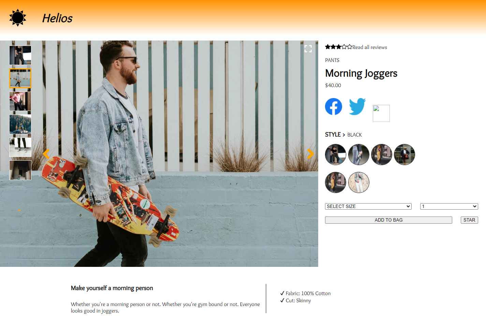
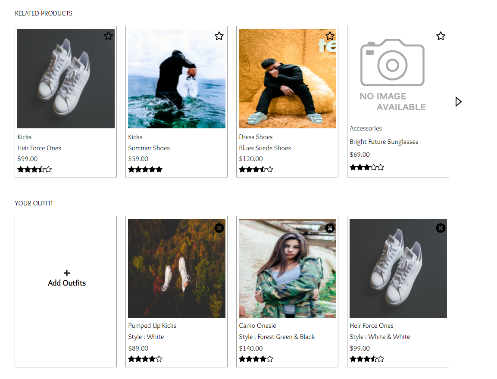
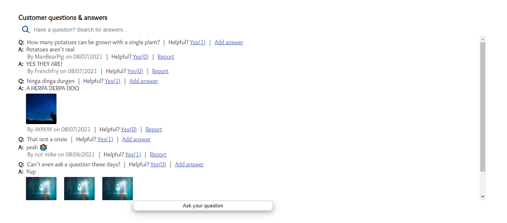
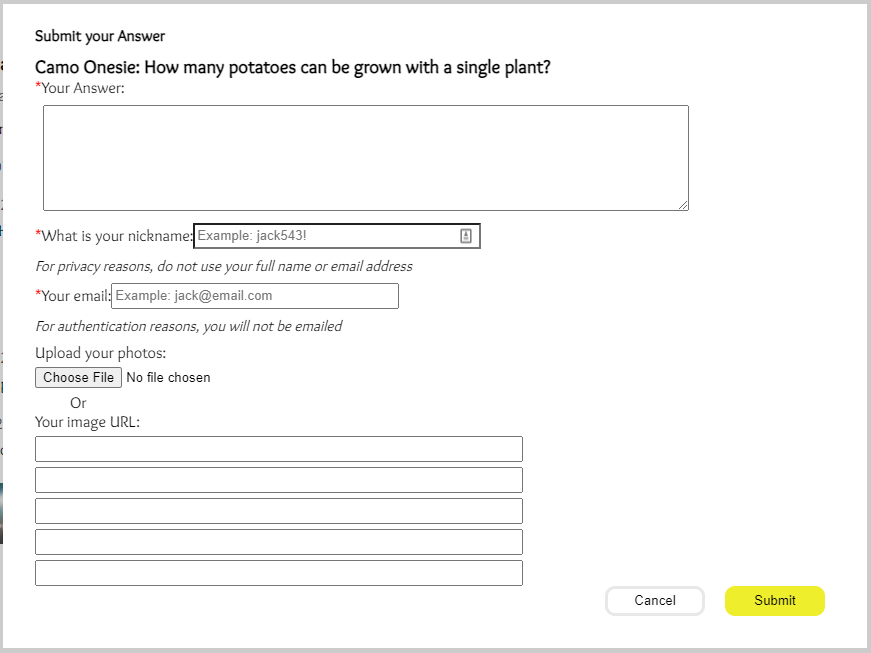
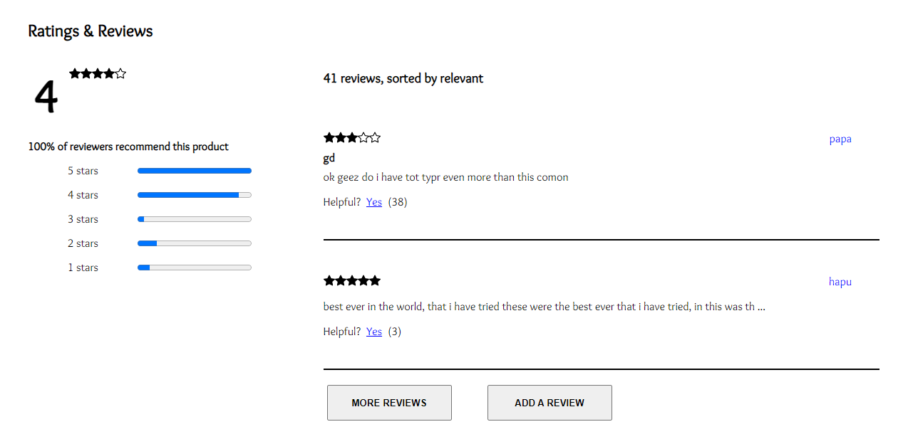

# Project Catwalk

Front End Capstone repository for HackReactor RFP54's Team Helios!

This capstone project tasked Team Helios with the challenge of redesigning an outdated retail portal. The redesign implemented a new user interface, and introduced significant client experience functionality.

---

## Tech Stack and Challenges

<code></code>

### React

- In order to implement a responsive, single-page application capable of dynamically rendering with third-party API data, we utilized React Context and Hooks.

<code></code>

### Nodejs

- Despite being a front-end capstone that explicitly placed back-end implementation out of scope, used Nodejs to utilize Express.

<code></code>

### Express

- Simplified API requests by implementing a proxy server in Express.js that adds authentication while forwarding requests to an existing RESTful API.

<code></code>

### CSS

- Aside from being the sole technology used for the aesthetic styling of this application:
  - All styling, including functional implementations like the modals and image gallery, were written solely with CSS.
  - The use of Grid made the overlay button functionality and precise placement of static assets accessible and simple.
  - Flexbox was instrumental in handling the wealth of dynamic data being delivered to the page.

<code></code>

### Jest

- Each of the 4 contributors took independent ownership over the development of each module present in the application, which introduced the need for rigorous, automated testing.
- React Testing Library kept our efforts and tests focused on the user experience while making it possible to test the vast amount of interactions and dynamic components in our application.

<code></code>

### Webpack

- Webpack was our solution to elegantly handle our numerous static assets, implement JSX, and harness ES6 in this project.

---

## Set up Instructions

How to host this single page application on your local machine.

1. Make sure you've pulled the version you want to run (see Git Workflow)
1. Make a copy of the file `server/config/config.example.js` and rename to `config.js`
1. Assign the `API_KEY` variable to your GitHub token
1. Install dependencies

    ```bash
    npm install
    ```

1. In one terminal, build the webpack bundle

    ```bash
    npm run watch
    ```

1. In another terminal, start the server

    ```bash
    npm start
    ```

1. Visit [localhost:3000](http://localhost:3000) in the browser

---

## App Components

### [Overview](client/src/components/overview/)

Developed by [Darion Williams](https://github.com/darionbuilds)



The Overview module rests at the top of the page and is responsible for delivering relevant information for a product in the catalogue. A single product can be associated to many styles, whose details and associated photos must be intuitively displayed.

It was a challenge to display this information to be viewed at a glance while also giving a prospective shopper the means to view the full details. This flexibility expressed in the business requirements made space a precious resource, so using Grid to create an image control overlay, and using CSS to create a modal to remove detailed image viewing from the page flow were vital.

### [Related Products](client/src/components/RelatedItems/)

Developed by [Lakshmy Mohan](https://github.com/lakshmyErakandath)



The Related Products presents the user with products similar to the currently selected product, provided by the external API.

This section shows four product cards at a time. They sit on a horizontally scrolling carousel that allows the user to scroll and view additional cards.

On each product card, essential information such as the category, name, price, image, and ratings are displayed. Selecting the name of a product will take the user to the overview page of the selected product.

When a user clicks on the star icon in the upper righthand corner of the card, a modal will pop up comparing the current product and the selected product. The modal displays a table with the features lined up for both products in a table, allowing the user to easily compare the two products.

### **My Outfit**

My Outfit provides the user a way to keep track of their favorite products. If the user wants to add the current product to their outfit, they can select the "+" button, adding the products card to the outfit.

To remove an outfit item, the user can click the  "X" on the upper righthand corner of the card. The change will remove the selected product from the outfit list.

The user can also view the sale price in red followed by the original price

My Outfit is also persistent, allowing the user to navigate around and even away from the application and maintain their list of saved products.

### [Questions & Answers](client/src/components/QandA/)

Developed by [Emily Liu](https://github.com/yyliu11)





The Q&A provides the questions and answers posted by users and sellers. 

All questions and answers are sorted by usefulness that is voted by users while the answers from sellers are listed on the top. 

The Live Search enables searching questions real time. 

The inline modals also allow user to submit questions and post answers to the existing questions. Meanwhile, the form authentication feature in the modal prevents dummy data from being sent to the API. 

### [Ratings & Reviews](client/src/components/Ratings/)

Developed by [Matt Heindel](https://github.com/matt-heindel)



View and submit reviews for the selected product.

Reviews loaded two at a time for improved initial page load performance.

Display progress bars visualizing a breakdown of the amount of each star rating received.
