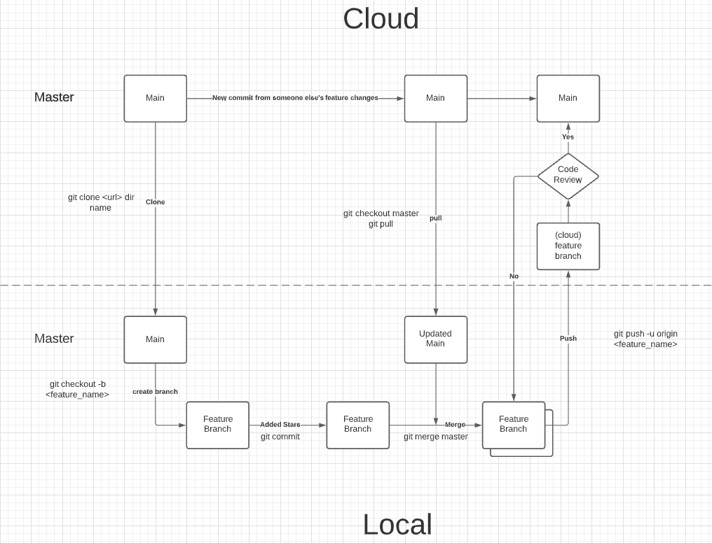

# FEC

Front End Capstone repository for RFP54's Team Helios!

## Git Workflow



[Lucid Chart](https://lucid.app/lucidchart/invitations/accept/inv_c4244f5b-aff7-4e56-9dfc-1a72d5248c76?viewport_loc=-635%2C558%2C2994%2C1437%2C0_0)

### General Rules

- Never work directly on the `main` branch
- Create a branch for each new feature
- Handle merge conflicts on local clone in VS Code
- Pull requests must be reviewed by another team member before closing
- If any changes are accidentally made before checking out run:
  1. Stash changes: `git stash`
  2. Check out into the new branch: `git checkout -b <feature_name>`
  3. Apply those changes to the new branch: `git stash pop`

### Creating a new Feature Branch

1. Clone from [organization repo](https://github.com/RFP54-Helios/FEC)

    ```bash
    git clone https://github.com/RFP54-Helios/FEC
    ```

1. Make sure you are on branch `main`
1. Create a branch with a name descriptive of the feature you are developing

    ```bash
    git checkout main
    git checkout -b feature-name
    # alternative
    git checkout -b <feature-name> main
    ```

1. Make changes, commit frequently

### Syncing changes with `main`

Avoid conflicts in PR

1. Switch to branch `main`
1. Pull changes made to main by others
1. Handle any merge conflicts in VS Code
1. Switch to `feature-branch`
1. Merge changes from `main` -> `feature-branch`
1. Push up to GitHub `feature-branch`

    ```bash
    git checkout main
    git pull
    # handle merge conflicts
    git checkout feature-branch
    git merge main
    git push origin feature-branch
    ```

### Adding Features from Branches to `main`

1. Submit Pull Request
    1. base:main <- feature-name
    1. reference Trello ticket with link
1. Code Review
1.
